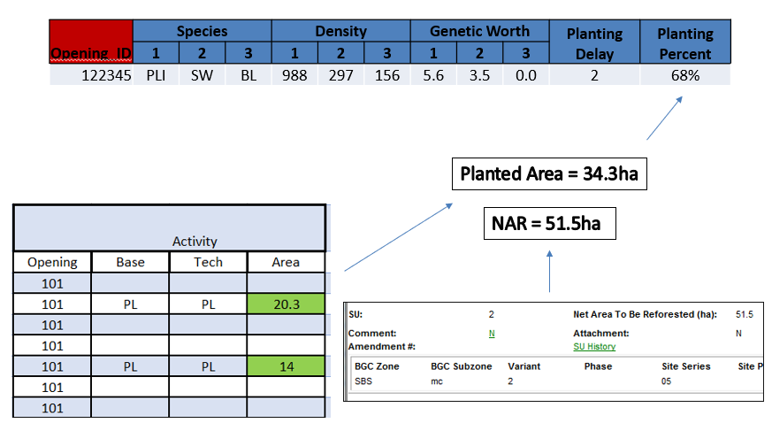

# Planted Percent

**Planting Inputs: Planting Percent**

___

A spatial mix of plant/natural can now be  directly modelled in Tipsy.
Otherwise, an opening is either a planted OR a natural stand.

Where the NAR is Null, the opening gross area is used in it’s place

Note that the term NAR is used, but in MSYT process we use the Forest cover Net Area.  
