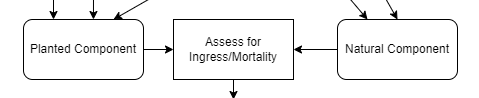

# Adjusting Stand Composition

**Managed Stand composition**

- Model Planted components and Natural components together.  
  

  

Batch Tipsy Composer handles these conditions.  

Models either Planted or Natural components.     

OR

Mixed plant/natural, where a stand isn’t 100% planted.    

Use forest cover survey data to update planted species composition.  

___

After processing all the layer information, For each opening we now have both a planted and a natural composition

In the perfect world we would model plant and natural together in one model. TASS

However, We can come up with an adjusted composition by looking at the plant and natural components together.

