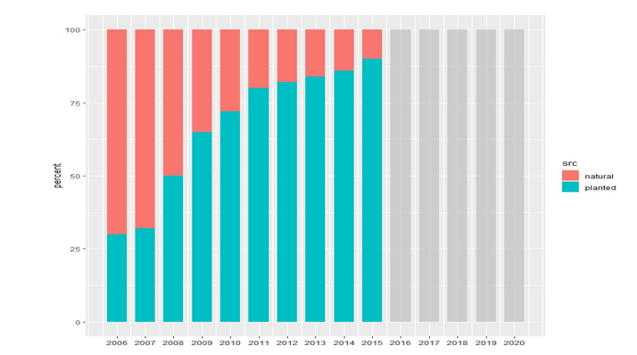

# Yield Aggregates

**Aggregated Inputs for TSR: **

Future stand aggregate species composition:  

- Based on “current performance”
- Valid planted 2006 -2015

___

Need to generate future stand attributes for stands that (in general) haven’t been logged yet.  
Based on existing management information.  

Derived from current practice  

Look at the inputs for planted stands after 2006 – 2015  
Ignore the latest 5 years as reporting to RESULTS is not likely completed.  

Extract this data from the tabulated data for planting and natural  
