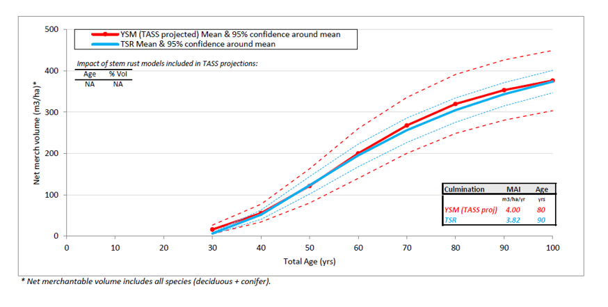

# YSM Validation: Yield

**Validation**

What we would like to see.  

Compare YSM data to MSYTs in a rolled up form.  

Each YSM plot has an associated MSYT (linked by feature). 

YSM is sampling features from VRI ages 15 - 50.  

The MSYT is compared to the plot data projected in TASS.  

But remember that the MSYT is derived at the opening level, so there can be differences at the feature level.

