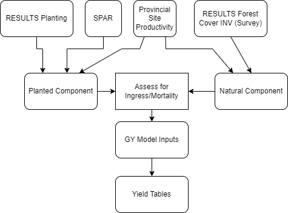

# Summary

## Summary: WHAT WE USE

- planting data for opening
- RESULTS Forest Cover Inventory label 
  - species composition
  - total number of stems

- from ANY RESULTS INVENTORY survey that can be verified for input to growth model

- this can include a free growing survey, but doesn't have to

## Summary: WHAT WE DO NOT USE

- Silviculture label
- well spaced stems
- Forest health data in the initial MSYTs
- VRI data for species composition (except for pre 87 stands)

