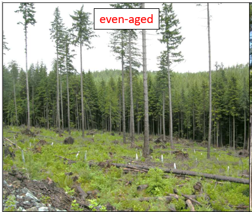

# Residual Stand Components

Residual Stand Structure

It has long been an established practice to leave certain trees standing after harvest.  This can be for a variety of reasons such as wildlife trees.  

For the most part, this part of a stand is ignored for the purposes of developing a MSYT.  But it is good to be aware of the structure that is captured in both VRI and in RESULTS.

In the VRI, rank is used to identify what the classifier thinks will be the crop trees.  This is governed by the crown closure of each layer seen by the classifier.  There are also rules in place:

1. Rank is already pre-determined for records with FIP and LVI inventory standard code  

2. For none FIP and LVI records, the first layer of a polygon  (ordered by ascending layer_id)  that has an crown closure greater than 10 and is not a D layer is assigned rank 1  

3. For polygons with no layers with a crown closure above 10, the layer with the largest crown closure and is not a D layer is assigned as rank 1.   

So there are cases where the residual layer will get assigned rank 1.  In an opening, this can sometimes be seen as:

| Opening Id | Feature Id | proj_age_1 | vri_live_stems_per_ha |
|:--|:--|:--|:--|
| 101 | 1 | 155 | 80 |
| 101 | 2 | 12 | 1200 |
| 101 | 3 | 14 | 800 |

But the feature needs to be checked to see if there are multiple layers.  This is found in the veg_comp_layer table.  So fot veg_Comp this can be seen as:

| Feature Id | Opening Id | proj_age_1 | vri_live_stems_per_ha | # layers |
|:---|:---|:---|:---|:---|
| 1 | 101 | 255 | 65 | 2 |

This gives the indication that there is some layered structure.  We would expect this stand to have a young age as it is within an opening.  We would also expect the density to represent a planted stand.  

Since the age and the density seem to not represent a managed stand, they we can presume that the rank 1 layer was assigned to a residual component.  

## Processing per 1987 stands

- filter for a single feature opening
- if sph < 75 kick it out (low denisty)

## Processing for non harvested areas

- look for age split between <50 and > 50
- check to see if there are multiple layers in each feature
- if there is only a single layer, then accept the age
- assign the older portion as non harvest

## Procesing RESULTS data

- the delineation of multi layers is based on the number of layers

## Classification Manual:

The standard now is that a polygon with 5% or greater CC will result in a BCLCS of VT, however I believe that 10% was the threshold in the past.  As explained by Marc, the RESULTS reader in VRIMS defaults to 11% so that they are recognizable as RESULTS records (classifiers don’t usually report to 1%).  As the threshold for VT is now 5%, we could make RESULTS polygons default to say 6%.  When surveyors provide crown closures for very young stands, they are often less than 5%.  As RESULTS ‘I’ standard records do not contain any Non-Tree/Non-Vegetated data, a crown closure of < 5% will result in a BCLCS of NLU, which then also effectively removes it from the FHLB (BCLCS1 = N  ->  FHLB = N).

